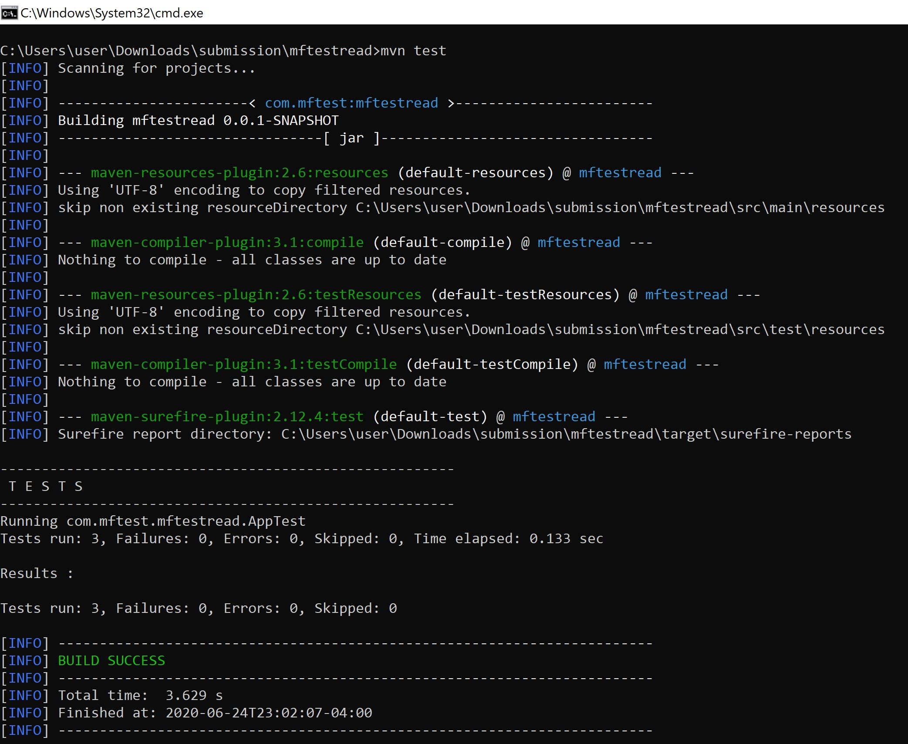

# Task for QE hiring prospects

You will make a small application in a programming language of your choice that takes CSV and JSON files as an input. The application should be able to be launched with a simple command, eg.

```bash
./extractor.sh "${path_to_input_json_or_csv}"
```

Example csv file content:

```csv
first_name,last_name,siblings,favourite_food,birth_timezone,birth_timestamp
DELIA,MCCRAE,5,chicken,−08:00,601605300000
EUGENE,VANDERSTEEN,2,Yogurt,+01:00,853371780000
BERNARDINA,STWART,1,Mozzarella cheese,+10:30,285926100000
```

Example json file content:
```json
[
{ "first_name": "LEONEL", "last_name": "FERREL", "siblings": "1", "favourite_food": "Meatballs", "birth_timezone": "−01:00", "birth_timestamp": "917172960000" },
{ "first_name": "SHANNA", "last_name": "HILYER", "siblings": "5", "favourite_food": "Meatballs", "birth_timezone": "−05:00", "birth_timestamp": "884072160000" },
{ "first_name": "CARLI", "last_name": "NEWKIRK", "siblings": "5", "favourite_food": "Candy", "birth_timezone": "+01:00", "birth_timestamp": "600794820000" }
]
```

The application will parse the specified file and print out the following information:

* Average number of siblings (round up)
* Top 3 favourite foods and the number of people who like them
* How many people were born in each month of the year (uses the month of each person's respective timezone of birth)


Example output :
```
Average siblings: 2

Favourite foods:
- Pizza      74
- Meatballs  36
- Ice Cream  33

Births per Month:
- January   654
- February   45
- March      38
- April      28
- May        11
- June       16
- July       13
- August      7
- September  32
- October     5
- November   30
- December   31
```

The application should have a robust test suite written using a standard testing library for the chosen language.

We strongly encourage you to:
* use 3rd party libraries for parsing (ie: fasterxml and/or json)
* take readability into account (comments are appreciated!)
* take performance into account
* ensure that it runs from the command line outside of your preferred IDE.

Assumptions you can make:
* The json and csv formats are valid and have all the fields required.
* The file extension can be relied on to indicate what the type of file.

# Solution:

## Project Structure
*  com.mftest.mftestread -This is main class App.java which starts the analyzing data based on the type of file. From command line it reads name of file as argument and passed to getParser which returns parser based on extension of file. Based on file extention it will call its parse method to retrieve the data save as List<User>type Then this data is passed to three analyzers and using getReport method of AnalyticsReport.java reportis displayed on console.

*  com.mftest.mftestread.model.User - The model class for each user in the test data set. The POJO of USER fields
*  com.mftest.mftestread.analyzers: Under this package you will find implementation of 

	* Analyzer.java: This is interface which is implmented by three Analyzer FavouriteFoodAnalyzer.java , BirthMonthsAnalyzer.java & AverageSiblingsAnalyzer.java. 
	
```Java
   public interface Analyzer {

	public AnalyticsReport analyze(List<User> users);
}
```

	* AnalyticsReport.java : This is class that builds report once analyzers are done analyzing. 
	
```Java

	String report;

	public AnalyticsReport(String report) {
		super();
		this.report = report;
	}

	public String getReport() {
		return report;
	}
```

From three Analyzers we pass report to AnalyticsReport.java by calling its constructor for example in AverageSiblingsAnalyzer.java:

```Java
// Building report
		return new AnalyticsReport("Average siblings: " + averageSiblings + System.lineSeparator())
```

Now in order to output in our App.java we call getReport() method of AnalyticsReport.java for example:

```Java
System.out.println(averageSiblings.analyze(users).getReport());
```
	* FavouriteFoodAnalyzer.java - Is used to generate the favorite food report. When data is passed in from App.java I have created HashMap to store data by iterating over List<User> update the counts . Once Map is built I have converedted it into List to sort by count .

	- BirthMonthsAnalyzer.java - Is used to generate the births per month report. When data is passed in from App.java I have created HashMap to store data by iterating over List<User>, during iteration I get Calendar instance based on timestamp from the conversion I get month and then update the counts . Since the Calendar instance returns numeric value representing months I convert the numeric to string .
	
	* AverageSiblingsAnalyzer.JAVA - Is used to generate the average siblings report. When data is passed in from App.java I iterate over it and using getSiblings method get value and add into variable and finally divide with number of users/records.

*	com.mftest.mftestread.parsers - Under this package you will find the implmentation of
- FileParser.java : This is interface which is implmented by CsvParser.java and JsonParser.java .
```Java
public interface FileParser {

	public List<User> parse(File file) throws FileParseException;
}

```

- CsvParser.java - Implmented the parse method using the CSV Parsing utility from apache.commons.csv and passing it the CSV file. Iterate through each CSVRecord, and adding it list of users. The method returns user records.
- JsonParser.java - Implmented the parse method using fasterxml's object mapper to read the json. Thus reading each line into user list, based on user model. The method returns user records.

# How to Setup & Run the project:-

Run the App From Command line:

- Git clone the project
- Install java and maven on your PC 
- Put the test data in root folder where the project is cloned in a csv or json file.
- To get the output run the following command in projjects root directory wehre pom.xml resides:
```
 mvn exec:java  -Dexec.mainClass=com.mftest.mftestread.App  -Dexec.args="population_sample.json"
 
 OR
 
 mvn exec:java  -Dexec.mainClass=com.mftest.mftestread.App  -Dexec.args="population_sample.csv"
```
<p align="center">
<br />
</p>
Run the Test

- To run the application tests: 
```
mvn Test
```
<p align="center">
<br />
</p>

Run the App from Eclipse
- After dowloading/clonning the project we will need to import the project in eclipse IDE.
- Open eclipse > go to file > click on import link 
- After Importing go to Run Configurations > Set Name , Project, & Main Class

<p align="center">
<br />
</p>

- Go to Arguments and set name of file .json or csv

<p align="center">
<br />
</p>

- In order to run app

<p align="center">
<br />
</p>

- App Output:

<p align="center">
<br />
</p>

Run the Test from Eclipse

- Go to Run Configurations > Set Name, Project and Test Class

<p align="center">
<br />
</p>

- In order to run test as JUnit

<p align="center">
<br />
</p>

- Test Output

<p align="center">
<br />
</p>